# Belter
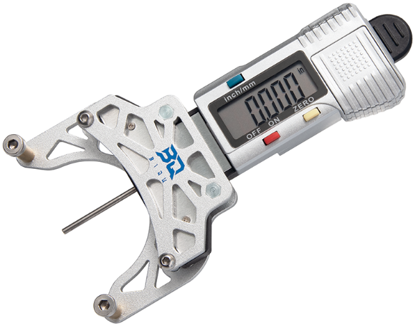

**Product Link:** [BIGTREETECH Official Website](https://biqu.equipment/products/biqu-belter-belt-tension-tool)

**GitHub Link:** [bigtreetech/Belter-belt-tension-Tool](https://github.com/bigtreetech/Belter-belt-tension-Tool)

## Introduction

Belter is a belt tension tool designed to help you measure and estimate belt tension. It features an intuitive digital readout for clear readings, making belt tension adjustments easier.

## Feature Highlights

- **Digital Display:** Provides intuitive and clear tension readings.
- **Precision Engineering:** Uses a lightweight aluminum alloy bracket for accurate measurements.
- **Single-Hand Operation:** Enables a convenient and efficient measurement process.

## Specifications

- **Product Name:** Belter
- **Bracket Material:** Anodized Aluminum
- **Unit Switching:** inch/mm
- **Power Source:** 1 × CR2032 3 V button battery (included)

## Product Structure

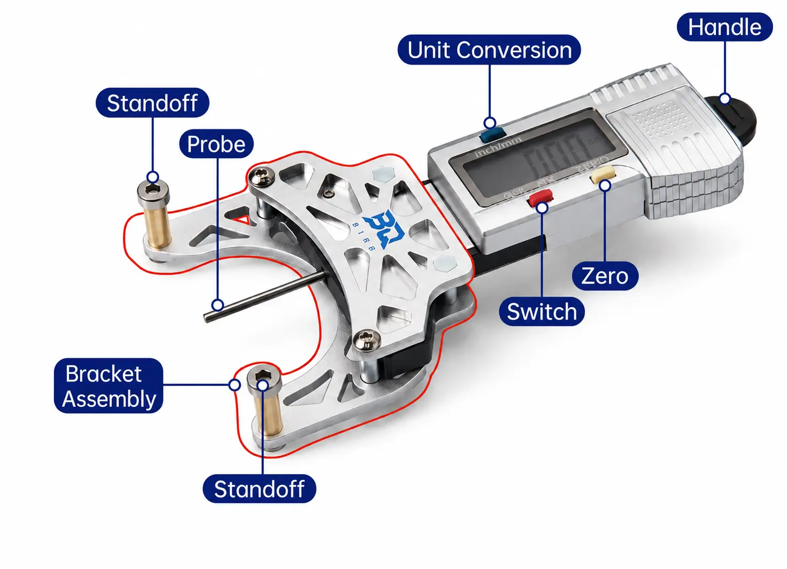

## Dimensions

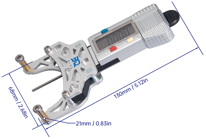

## Printed Parts Preparation

Find all printed parts models here: [PrintParts](https://github.com/bigtreetech/Belter-belt-tension-Tool/tree/master/PrintParts)

- Print and install `ProbeTip` to ensure accurate measurements.
- Print and install the `Hand Held bracket` and `Plunger` for single-handed operation.
- Print the `zeroing tool` and have it ready for the calibration process.

## Calibration Process

1. Open the [Belter Calculation Tool](https://belter.bttwiki.com/).

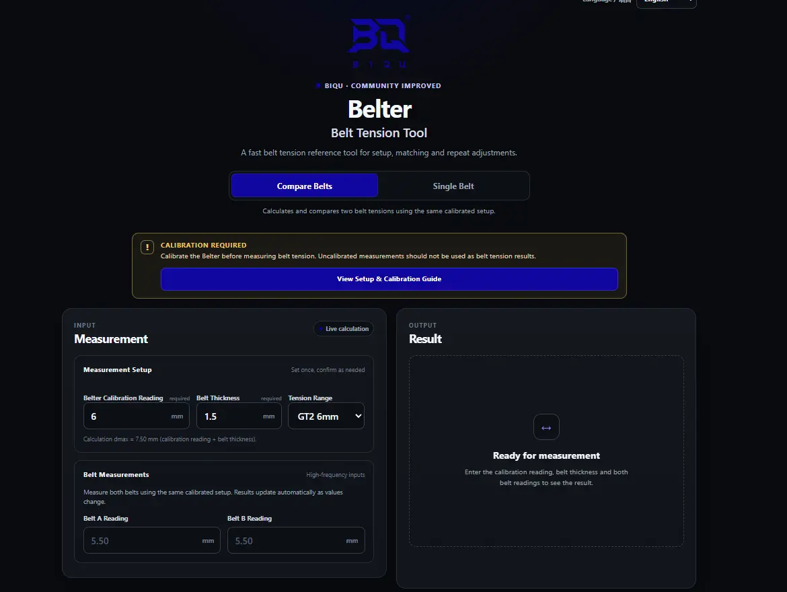

2. Push the bracket assembly against the depth gauge to make sure it is properly seated. Check that all bracket screws are tight and that the bracket is not loose.

3. Zero the reading on the depth gauge.

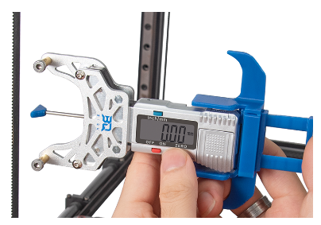

4. Install the zeroing tool.

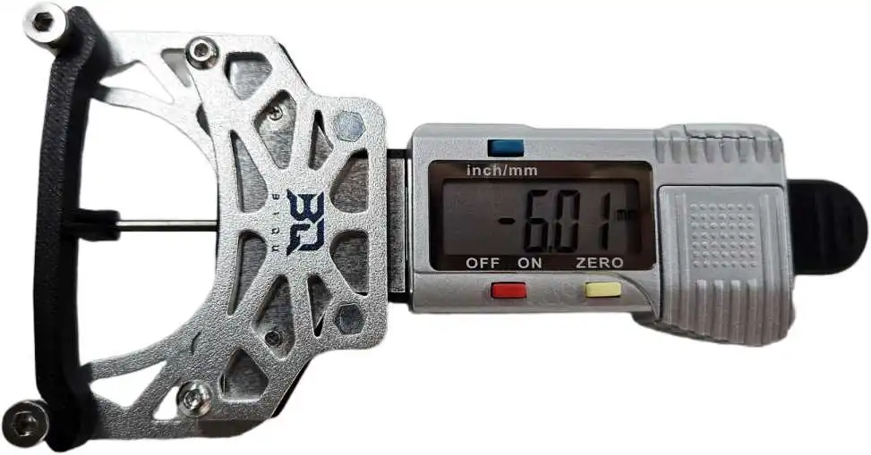

5. Record the Belter reading and enter it into the calculation tool under **Belter Calibration Reading**.

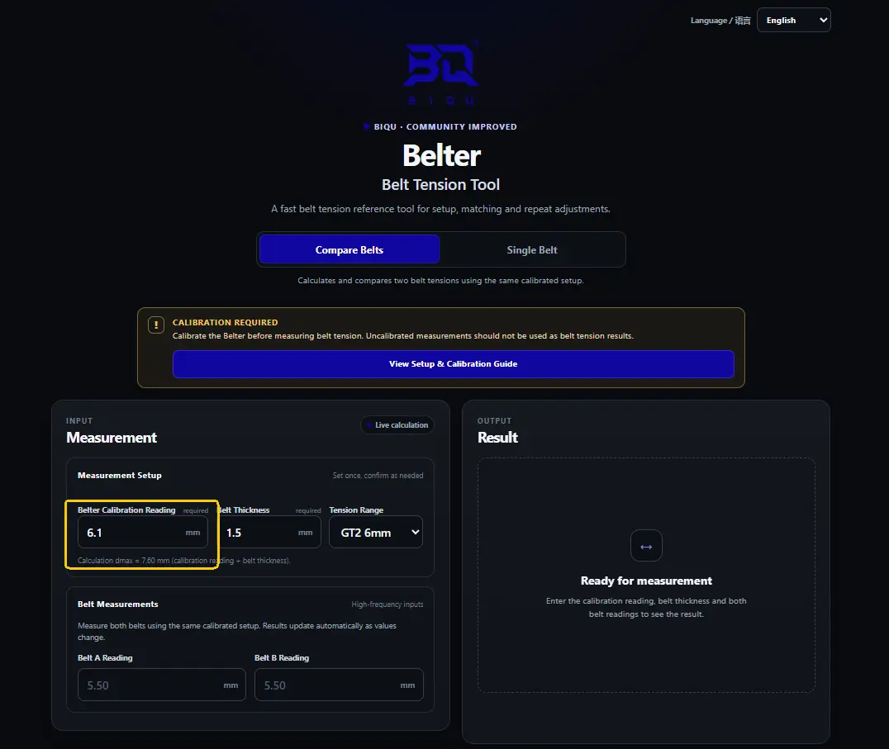

6. Measure the thickness of your belt with a caliper.

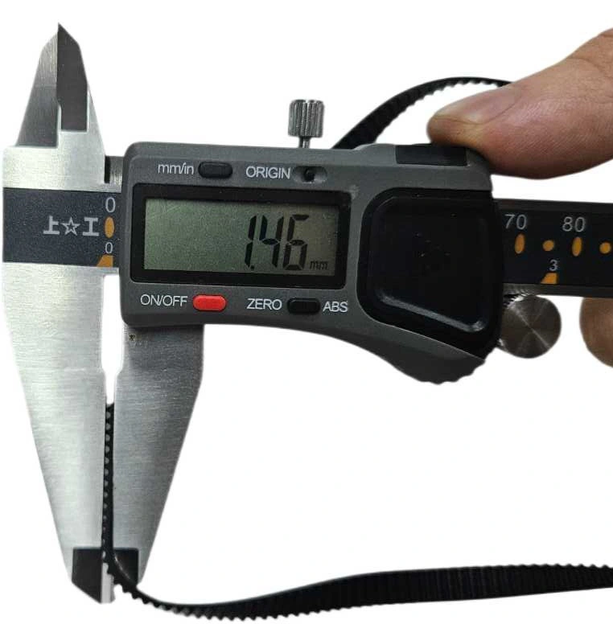

7. Enter the belt thickness value into the calibration tool under **Belt Thickness**.

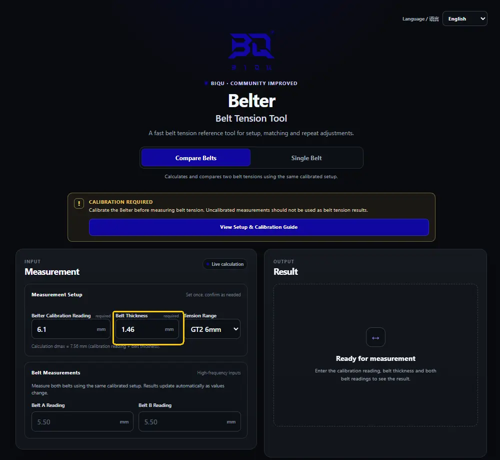

8. Select the correct belt spec for tension range check.

For Custom belts, select "Custom Range" to put in your own Min and Max tension to be checked against.

Congratulations, you have now finished the calibration process!

## Belt Tension Measurement 

1. Measure the belt tension as shown in the picture and enter the reading into the calculation tool.

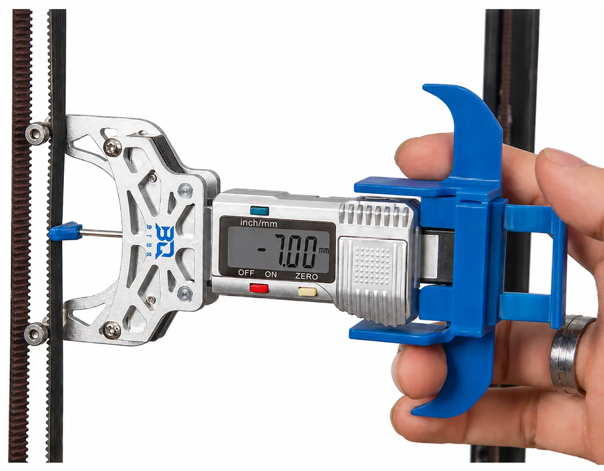

## Calculation Tool Instructions

### Compare Belts

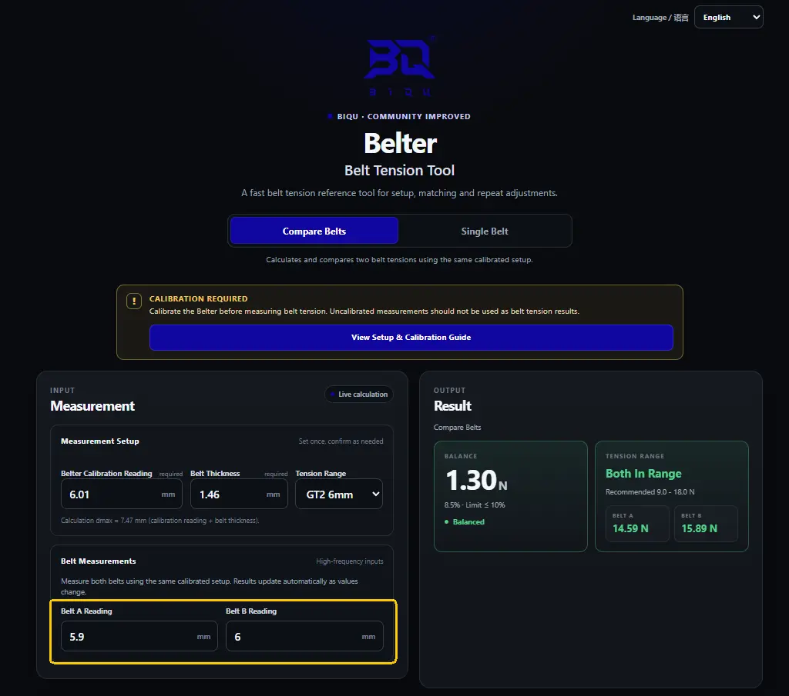

Use this mode when you want to match the tension of two belts, such as the two belts on a CoreXY printer.

1. Measure **Belt A** with the Belter.
2. Enter the reading into **Belt A Reading**.
3. Measure **Belt B** using the same setup.
4. Enter the reading into **Belt B Reading**.

The result updates automatically.

Check the following:

- **Balance:** Shows the tension difference between Belt A and Belt B.
- **Difference %:** A difference of 10% or less is considered balanced.
- **Tension Range:** Shows whether both belts are within the recommended tension range.

For best results, aim for:

**Balanced belts + both belts within the recommended range.**

### Single Belt

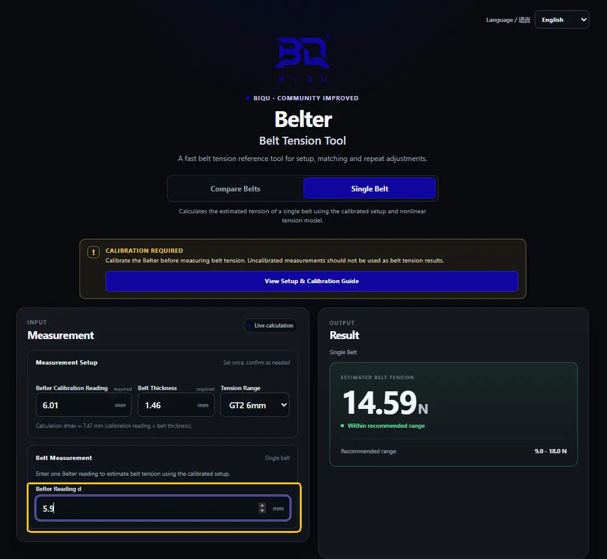

Use this mode when you only want to estimate the tension of one belt.

1. Measure the belt with the Belter.
2. Enter the value into **Belter Reading**.
3. The estimated belt tension appears automatically.

The tool will also show whether the tension is within the recommended range for the selected belt width.

### Important Tips

- Always calibrate the Belter before relying on the tension results.
- Use the correct belt thickness and belt width.
- When comparing two belts, use the same Belter setup and calibration for both measurements.
- The results update automatically—there is no **Calculate** button.
- Remeasure after adjusting the belt tension until the desired result is reached.

The calculated tension is an estimated reference value for adjusting 3D printer belt tension.

## Calculation Model Calibration (Optional)

> This step is optional. The Belter Calculation Tool already includes a default calculation model.
>
> Advanced users can follow the steps below to generate custom calculation parameters based on their own Belter and measurement setup.

1. Make sure the **Belter Calibration Reading**, **Belt Thickness**, and **Belt Width** entered in the Belter Calculation Tool are the same values used during the calibration process.

2. Prepare test loads from **500 g to 2000 g**, in **100 g increments**.

The cheapest and easiest test-load option is to use a container larger than 2 L and a digital scale. Add water until the target load is reached, confirm the weight on the scale, and then perform the Belter measurement.

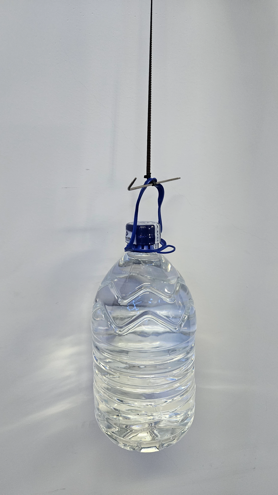

The complete test range is:

`500 g, 600 g, 700 g, 800 g, 900 g, 1000 g, 1100 g, 1200 g, 1300 g, 1400 g, 1500 g, 1600 g, 1700 g, 1800 g, 1900 g, 2000 g`

3. Hang the **500 g** test load on a length of belt and allow the belt and test setup to settle before taking a measurement.

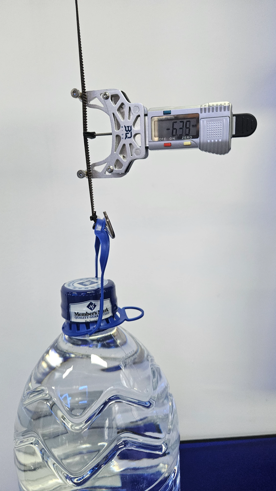

4. Install the Belter and record the reading in the provided [calibration spreadsheet](https://github.com/bigtreetech/Belter-belt-tension-Tool/tree/master/Calculation%20Tool/).

For best repeatability, completely remove and reinstall the Belter between each measurement.

5. Measure the same test load **12 times**.

After each measurement:

`Measure → Record the reading → Remove the Belter → Reinstall the Belter → Measure again`

6. Repeat the same process for each test load from **500 g to 2000 g**.

The spreadsheet will automatically calculate the measurement results for each test load.

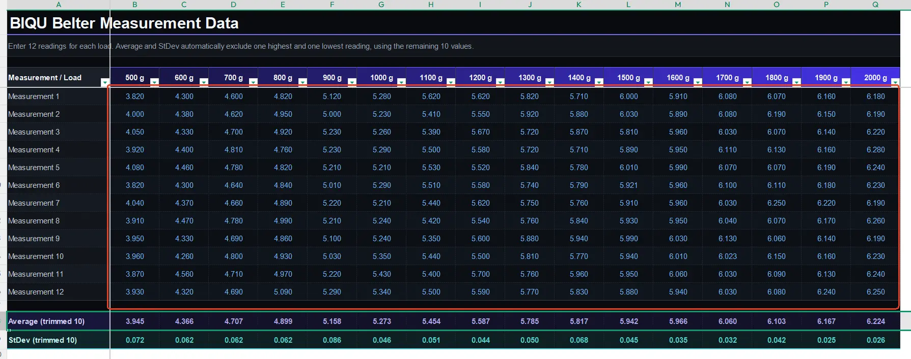

7. For every group of 12 measurements, the spreadsheet automatically removes:

- The highest reading
- The lowest reading

The remaining **10 readings** are used to calculate **Average (trimmed 10)**.

The spreadsheet also displays **StDev** to help evaluate measurement repeatability.

8. After all test loads have been measured, select and copy the complete **Average (trimmed 10)** row from **500 g to 2000 g**.

You can also include the **Average (trimmed 10)** label cell when copying. The Belter Calculation Tool will ignore the label automatically.

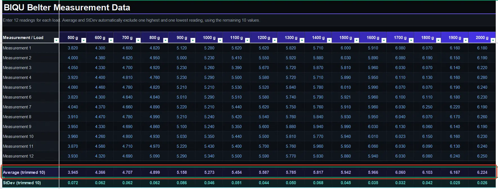

9. Open the **Fit Parameters from Test Data** section in the Belter Calculation Tool.

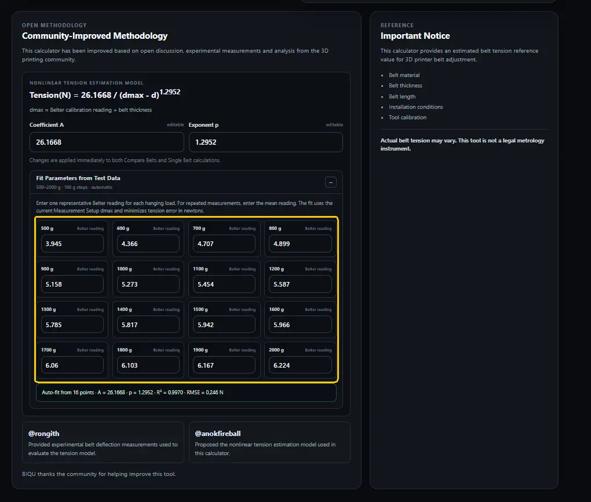

10. Click any test-data input field and paste the copied **Average (trimmed 10)** row.

The Belter Calculation Tool will automatically recognize the values and assign them in order from:

`500 g → 600 g → 700 g → ... → 2000 g`

11. The Belter Calculation Tool will automatically fit the measurement data and calculate a custom **Coefficient A** and **Exponent p** for the tension model:

`Tension = A / (dmax - d)^p`

The fitted parameters are automatically applied to both **Compare Belts** and **Single Belt** modes.

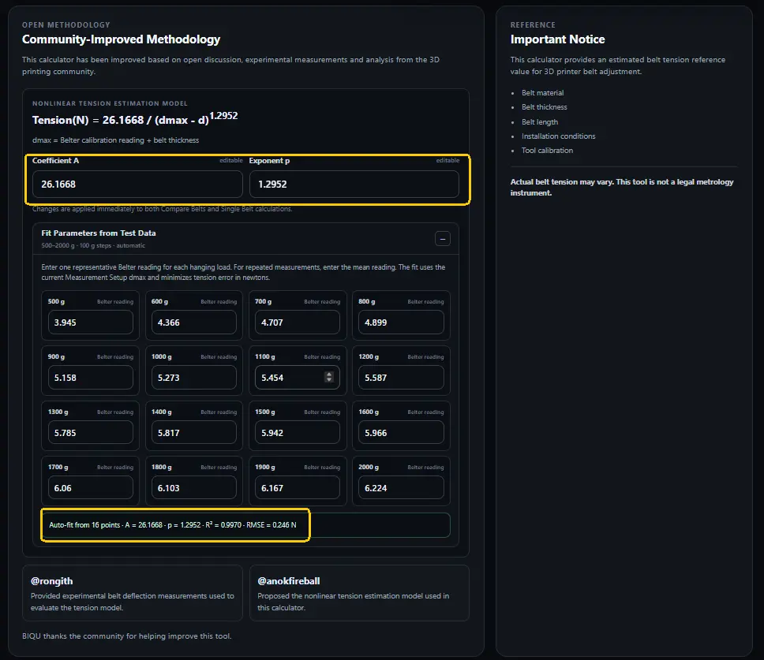

Congratulations, you have now finished the optional calculation model calibration!

## Community Acknowledgement

BIQU sincerely thanks all community members and users who have contributed to the development and testing of the Belter.

Special thanks to @rongith for providing experimental belt deflection measurements and test data, and to @anokfireball for proposing and analyzing the nonlinear belt tension estimation model used to improve the Belter Calculation Tool.

Your real-world testing, data sharing, technical discussions, and feedback have played an important role in improving the Belter measurement workflow and calculation method. BIQU greatly appreciates the time and effort contributed by the 3D printing community and will continue to improve the Belter based on practical experience and community feedback.

## Product Purchase Link

[Purchase the Belter](https://biqu.equipment/products/biqu-belter-belt-tension-tool)

If you experience any issues with this product, please contact us and submit a support ticket.

[Submit a support ticket](https://biqu3d.com/pages/submit-a-ticket)

## Navigation

- [BIQU Official Website](http://biqu3d.com/)
- [BIGTREETECH Official Website](http://bigtree-tech.com/)
- [Online Store](https://biqu.equipment/)
- [Community](https://community.biqu3d.com/)
.equipment/)

Community: [https://community.biqu3d.com](https://community.biqu3d.com/)
qu.equipment/)

Community: [https://community.biqu3d.com](https://community.biqu3d.com/)
